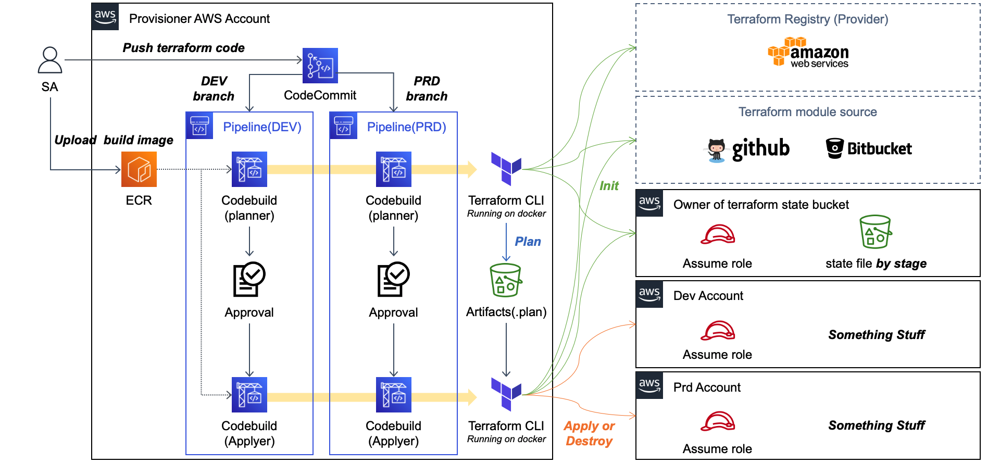
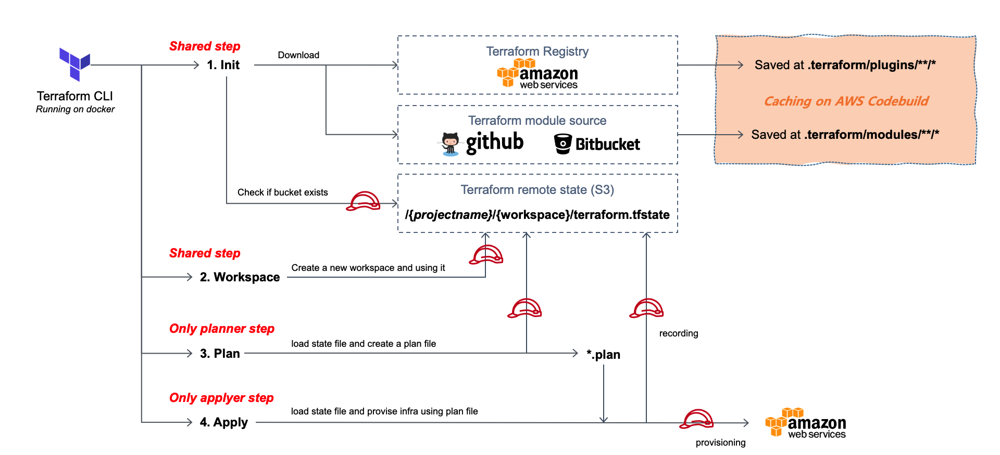

# Overview

AWS Codepipeline를 활용하여 Terraform CICD를 생성하는 모듈입니다. 하단의 내용은 `terraform-docs`에 의해 생성되었습니다.


# Architecture

AWS의 CodeSeires를 활용한 Terraform CICD 구성 방안에 대한 내용임.

## Overview



- **Repository** : AWS CodeCommit으로 구현하였으며, 하나의 프로젝트 당 하나의 Repository를 활용
  - 운영 환경(Dev, Prd, Stg,,,)은 Branch로 구분됨
  - Repository에 필수적인 구성요소는 다음과 같음
  	- `Terraform Configuration`
    - `.config` : Pipeline에 대한 설정
  	- `backend.tfvars` : Remote state에 대한 설정
  	- `provider.tfvars`: Provisioning을 위한 Assume role에 대한 설정
- **Launch terraform cli** : AWS Codebuild로 구현하였으며, 하나의 프로젝트 당 하나의 Codebuild 활용
  - AWS Codebuild에서 사용할 이미지는 `alpine`을 기반으로 작성하여 ECR에 별도 업로드
  - Pipeline Step에 따라 환경변수 값을 통해 planner 혹은 applyer로 분기됨
  - 확장성을 고려하여 Remote State를 사용할때에는 별도의 Assume role 필요
  - 확장성을 고려하여 Provisioning에 필요한 권한은 별도의 Assume role 필요
- **Pipeline**
  - **[Step1] Source** : Repository에서 Terraform Configuration 및 설정 파일을 읽어옴
  - **[Step2] Planner** : Terraform Configuration에 정의된 리소스들을 생성하거나 삭제할 plan 파일 생성
  - **[Step3] Approval** : 최종 승인
  - **[Step4] Applyer** : plan 파일을 기반으로 리소스 생성 및 삭제


## Detail of terraform cli


- **Shared step**
  - planner와 applyer가 공통적으로 실행하는 내용들임
  - 시간과 비용에 효율 고려하여 plugin과 module들은 caching 활용했으며 특히, AWS Provider는 200MB가 넘기에 ECR에 내장시켜서 활용
  - 운영환경 별 State 파일의 분리를 위해 Terraform workspace 기능 활용
- **Planner step**
  - pipeline에서 입력한 `BUILDSTEP` 값이 `planner` 인 경우에 시작됨
  - `.config` 파일에서 `BUILDACTION` 값이 `apply` 인 경우, 생성을 위한 plan 파일 작성하여 Artifact로 출력
  - `.config` 파일에서 `BUILDACTION` 값이 `destroy` 인 경우, 제거를 위한 plan 파일 작성Artifact로 출력
- **Applyer step**
  - pipeline에서 입력한 `BUILDSTEP` 값이 `applyer` 인 경우에 시작됨
  - `.config` 파일에서 `BUILDACTION` 값이 `apply` 인 경우, plnnaer에서 생성한 plan 파일을 기반으로 리소스 생성
  - `.config` 파일에서 `BUILDACTION` 값이 `destroy` 인 경우, plnnaer에서 생성한 plan 파일을 기반으로 리소스 제거

## Buildspec.yaml

AWS Codebuild에서 사용하는 buildspec임.

```yaml
version: 0.2

env:
  variables:
    ##################################
    # Pipeline에 대한 설정 값입니다.
    CONFIG_FILE: ".config" 
    ##################################

    ##################################
    # terraform init 과정에서 module을 갱신합니다.
    FORCE_INIT: "false"
    ##################################

    ##################################
    # Terraform 실행에 대한 내용입니다.
    # TF_LOG: "TRACE"
    TF_CLI_ARGS: "-no-color"
    TF_PLUGIN_CACHE_DIR: "/usr/lib/terraform-cache/"
    ##################################


phases:
  pre_build:
    commands:
      ##################################
      # CONFIG 파일로 부터 값을 읽어와 환경변수에 추가합니다.
      - export $(xargs < $CONFIG_FILE)
      # [필수] BUILDACTION
      ##################################
      
      ##################################
      # AWS Codecommit으로 부터 Module을 다운로드 받을 때, AWS CLI 권한을 사용하도록 설정합니다.
      # - git config --global credential.helper "!aws codecommit credential-helper $@"
      # - git config --global credential.UseHttpPath true
      ##################################

      ##################################
      # Terraform init을 수행합니다.
      - terraform init -input=false -upgrade=$FORCE_INIT -backend-config=backend.tfvars
      ##################################

  build:
    commands:
      ##################################
      # Terraform Workspace를 생성 및 선택합니다.
      - terraform workspace new $WORKSPACE && terraform workspace select $WORKSPACE || terraform workspace select $WORKSPACE
      ##################################

      ##################################
      # 현재 실행중인 Build의 단계에 따라 Plan을 생성하거나 인프라에 적용합니다.
      - |
        if [ "$BUILDSTEP" == "planner" ]; then
          if [ "$BUILDACTION" == "apply" ]; then
            terraform plan -var-file=provider.tfvars -out=$CODEBUILD_BUILD_ID.plan
          elif [ "$BUILDACTION" == "destroy" ]; then
            terraform plan -var-file=provider.tfvars -out=$CODEBUILD_BUILD_ID.plan -destroy
          fi
        elif [ "$BUILDSTEP" == "runner" ]; then
          terraform apply -auto-approve $(ls $CODEBUILD_SRC_DIR_TerraformPlan/*.plan)
        fi
      ##################################

artifacts:
  name: $TIMESTAMP_$CODEBUILD_BUILD_ID
  files:
    - "$CODEBUILD_BUILD_ID.plan"

cache:
  paths:
    - ".terraform/plugins/**/*"
    - ".terraform/modules/**/*"
```

## Dockerfile

AWS Codebuild에서 사용하는 빌드 이미지에 대한 Dockerfile입니다.

```Dockerfile
FROM python:rc-alpine3.13

RUN apk add --no-cache git jq && \
    pip3 --no-cache-dir install awscli

ADD https://releases.hashicorp.com/terraform/0.14.8/terraform_0.14.8_linux_amd64.zip /usr/bin/
ADD https://releases.hashicorp.com/terraform-provider-aws/3.32.0/terraform-provider-aws_3.32.0_linux_amd64.zip /usr/lib/terraform-cache/
```


<!-- BEGIN_TF_DOCS -->
<!-- END_TF_DOCS -->